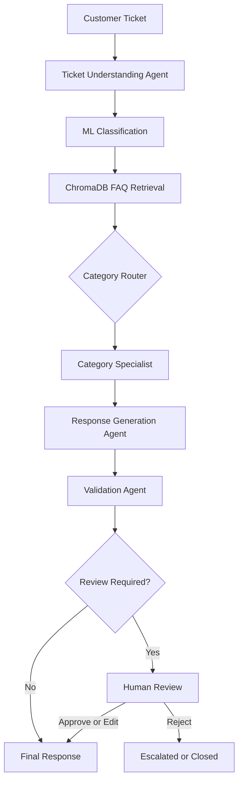

# Multi-Agent Customer Support Intelligence Platform

An AI-powered e-commerce customer-support platform that combines machine-learning classification, ChromaDB retrieval-augmented generation (RAG), LangChain, and LangGraph multi-agent orchestration to understand, route, resolve, validate, and review support tickets.

## Overview

E-commerce support teams handle large volumes of tickets involving delivery, returns, payments, product quality, account access, application errors, and seller listings. Manual processing can result in slow responses, incorrect routing, inconsistent resolutions, and unsupported promises.

This project implements a hybrid AI workflow that:

- Extracts structured intent, urgency, order information, and issue details from a ticket
- Predicts category, priority, and sentiment using scikit-learn models
- Retrieves relevant FAQ guidance from a persistent ChromaDB knowledge base
- Routes the ticket to a category-specific support specialist
- Generates a grounded customer-facing response
- Validates the response for policy compliance, completeness, tone, and unsupported claims
- Automatically finalizes safe responses or pauses for human approval, editing, or rejection

## Architecture



## How it works

### Ticket Understanding Agent

Extracts structured information such as:

- Intent
- Issue summary
- Requested action
- Urgency
- Order ID
- Product name
- Missing information and clarification questions

### Classification

Uses trained TF-IDF and Logistic Regression pipelines to predict:

- Ticket category
- Priority
- Sentiment
- Confidence score for each prediction

Low-confidence predictions automatically contribute to human-review routing.

### Specialist Agents

The predicted category routes the ticket to one of seven specialists:

- Delivery Issue Specialist
- Refund & Return Specialist
- Payment Issue Specialist
- Product Issue Specialist
- Account & Login Specialist
- App & Website Issue Specialist
- Seller & Product Listing Specialist

Each specialist uses category-specific instructions and retrieved FAQ evidence to recommend a safe resolution.

### Response Generation Agent

Transforms the internal resolution plan into a concise and empathetic customer response without exposing internal model details or claiming that unverified actions have already occurred.

### Validation Agent

Checks the generated response for:

- RAG grounding
- Unsupported actions or promises
- Policy compliance
- Completeness
- Tone
- Safety

### Human Review

LangGraph `interrupt()` pauses workflows that require review. A support representative can:

- Approve the response
- Edit the response
- Reject the response

The workflow resumes using the same LangGraph `thread_id`.

## Tech stack

| Layer | Technology |
| --- | --- |
| Language | Python 3.11 |
| Agent orchestration | LangGraph |
| LLM components | LangChain and OpenAI |
| Structured outputs | Pydantic |
| ML classification | scikit-learn |
| Text features | Word and character TF-IDF |
| Embeddings | `sentence-transformers/all-MiniLM-L6-v2` |
| Vector database | ChromaDB |
| Backend API | FastAPI |
| Frontend | Streamlit |

## Dataset

The project uses synthetic e-commerce data:

- 10,000 historical support tickets
- 150 FAQ knowledge-base entries
- Seven support categories
- Three priority levels
- Five sentiment levels

Raw datasets are preserved under `data/raw/` and `data/knowledge_base/`. Preprocessing creates separate processed files and extracts order IDs without overwriting the source data.

## Project structure

```text
06-Multi-Agent-Customer-Support-Intelligence-Platform/
├── data/
│   ├── raw/
│   ├── processed/
│   └── knowledge_base/
├── models/
├── artifacts/
├── vector_store/
├── src/
│   ├── agents/
│   ├── api/
│   ├── classification/
│   ├── data_preparation/
│   ├── graph/
│   ├── rag/
│   ├── ui/
│   ├── config.py
│   └── schemas.py
├── .env.example
├── .gitignore
├── requirements.txt
└── README.md
```

`models/`, `artifacts/`, `data/processed/`, and `vector_store/` are generated locally and are gitignored.

## Setup

### 1. Clone the repository

```bash
git clone <your-repository-url>
cd 06-Multi-Agent-Customer-Support-Intelligence-Platform
```

### 2. Create a virtual environment

```bash
python3.11 -m venv .venv
source .venv/bin/activate
```

Windows:

```bash
.venv\Scripts\activate
```

### 3. Install dependencies

```bash
python -m pip install --upgrade pip
python -m pip install -r requirements.txt
```

### 4. Configure environment variables

```bash
cp .env.example .env
```

Add your configuration to `.env`:

```env
OPENAI_API_KEY=your-api-key
LANGSMITH_API_KEY=
LANGSMITH_PROJECT=multi-agent-customer-support
LANGSMITH_TRACING=false
LLM_MODEL=gpt-4o-mini
LLM_TEMPERATURE=0.0
```

Never commit `.env` or API keys.

## Build artifacts

Trained classifiers and the ChromaDB store are not committed. Build them locally before running the API.

### 1. Inspect and validate data

```bash
python -m src.data_preparation.inspect_data
python -m src.data_preparation.validate_data
```

### 2. Prepare datasets

```bash
python -m src.data_preparation.prepare_data
python -m src.data_preparation.create_splits
```

### 3. Train classifiers

```bash
python -m src.classification.train_classifiers
```

### 4. Build the ChromaDB knowledge base

```bash
python -m src.rag.build_vector_store
```

## Run

Start FastAPI with a single worker. The workflow uses `InMemorySaver`, so interrupted reviews are lost if the process restarts or if multiple workers are used.

```bash
python -m uvicorn src.api.main:app --reload --port 8000
```

- API docs: [http://127.0.0.1:8000/docs](http://127.0.0.1:8000/docs)
- Health check: [http://127.0.0.1:8000/health](http://127.0.0.1:8000/health)

Start Streamlit in a second terminal:

```bash
source .venv/bin/activate
python -m streamlit run src/ui/app.py
```

Open [http://localhost:8501](http://localhost:8501). The UI calls FastAPI at `http://127.0.0.1:8000` by default. Override that with `API_BASE_URL` if needed:

```bash
API_BASE_URL=http://127.0.0.1:8000 python -m streamlit run src/ui/app.py
```

## API

### Process a ticket

`POST /tickets/process`

```bash
curl -X POST http://127.0.0.1:8000/tickets/process \
  -H "Content-Type: application/json" \
  -d '{"ticket_text": "My order has not arrived and tracking has not updated for five days."}'
```

```json
{
  "ticket_text": "My order has not arrived and tracking has not updated for five days."
}
```

The endpoint returns either `completed` or `human_review_required`, along with the workflow `thread_id` and current state.

### Review an interrupted workflow

`POST /tickets/{thread_id}/review`

Approve:

```json
{
  "action": "approve",
  "reviewer_comment": "Reviewed and approved."
}
```

Edit:

```json
{
  "action": "edit",
  "subject": "Update regarding your delayed order",
  "message": "Please provide your order ID so our team can review the delivery status.",
  "reviewer_comment": "Simplified the response."
}
```

Reject:

```json
{
  "action": "reject",
  "reviewer_comment": "Further investigation is required."
}
```

### Get workflow state

`GET /tickets/{thread_id}/state`

### Health

`GET /health`

```json
{
  "status": "healthy"
}
```

## Evaluation notes

Random stratified splitting produced strong validation results for category and priority classification. Leakage analysis also found repeated or closely related synthetic templates across splits, which can make category performance optimistic.

Template-aware evaluation was explored separately and showed reduced performance on unseen wording. The MVP retains the original stratified split for development while documenting template leakage as a known limitation. Real-world deployment would require more diverse human-authored tickets, template-aware evaluation, probability calibration, and ongoing monitoring.

## Limitations

- The dataset is synthetic and may not represent real customer language.
- Similar ticket templates can appear across random train and validation splits.
- Sentiment prediction shows weaker generalization than category and priority prediction.
- `InMemorySaver` loses interrupted workflows when the API process restarts.
- The API should run with one worker while using in-memory checkpointing.
- The FAQ knowledge base is small and does not replace complete company policy documentation.
- Authentication and role-based access control are not yet implemented.
- Human-review feedback is not yet stored for model retraining.

## Roadmap

- Replace `InMemorySaver` with SQLite or PostgreSQL checkpointing.
- Add LangSmith tracing, latency, token, and cost monitoring.
- Add persistent ticket and reviewer audit records.
- Add authentication and reviewer roles.
- Create retrieval and agent evaluation datasets.
- Add retry policies and structured error handling.
- Add feedback-driven retraining and model registry integration.
- Add multilingual ticket support.
- Containerize the API, UI, and supporting services.
- Deploy with persistent storage and production monitoring.

## Responsible AI

- Low-confidence predictions are routed for human review.
- Generated responses are validated before finalization.
- Agents are instructed not to invent policies or completed actions.
- Retrieved FAQs are retained as supporting evidence.
- High-risk fraud, security, safety, and policy-exception cases require escalation.
- Human reviewers can approve, edit, or reject generated responses.

## License

This project is intended for educational and portfolio use. Add an appropriate open-source license before redistributing or accepting external contributions.
